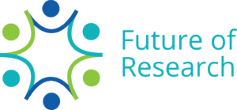
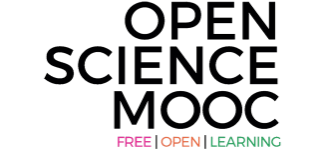
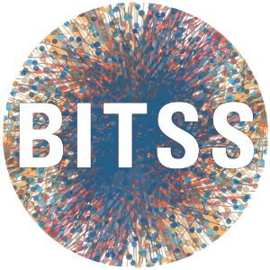
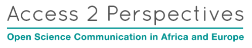
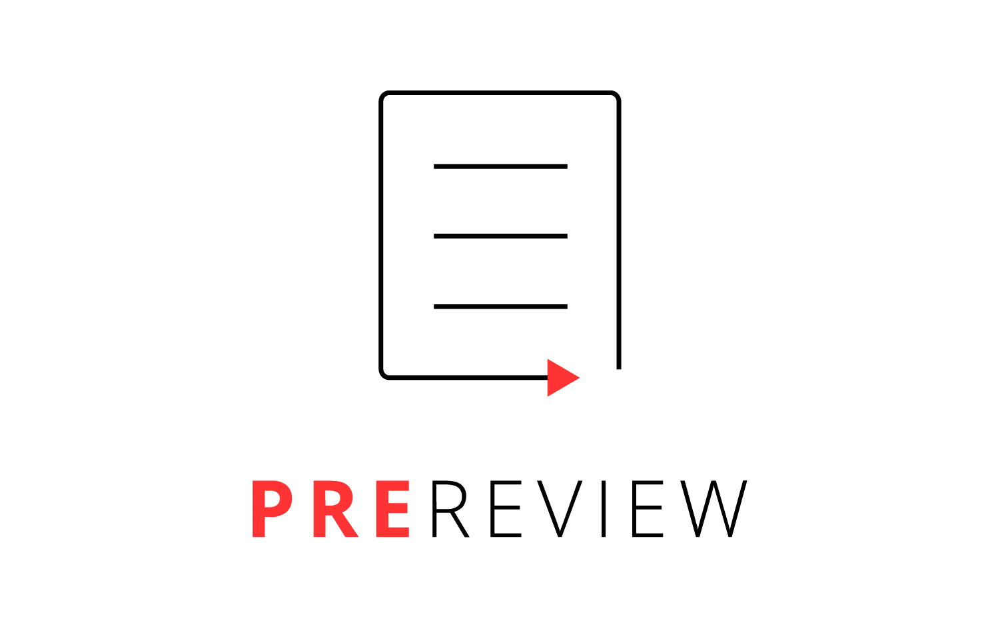

<iframe width="560" height="315" style="text-align:center" src="https://www.youtube.com/embed/Q33K-nkzHj0" frameborder="0" allow="accelerometer; autoplay; clipboard-write; encrypted-media; gyroscope; picture-in-picture" allowfullscreen></iframe>{: .mx-auto.d-block :}

### Why is this project needed?
Academia is trapped in a [collective action problem](https://en.wikipedia.org/wiki/Collective_action_problem): individual researchers are incentivised to act in ways that hurt their community's best interest and, ultimately, their own (e.g., publishing in legacy journals, or keeping one's code and data private). Any one individual could take a stand against this pressure, of course, but by doing so they would be placing their career at risk. Fears like these have held back progress in academia to the point where today, decades after the internet was developed, we are still disseminating knowledge via antiquated formats (e.g., 'papers' published in 'journals') and failing to use the internet to its fullest advantage (e.g., sharing data and code openly and collaboratively).

### How could we fix this problem?
Imagine if every researcher in the world decided that from tomorrow, we would do things differently. We might decide to boycott legacy journals in favour of fee-free open access journals ('platinum' or 'diamond' open access), thus boosting their reputation and allowing us to support them without fear for our careers. We might decide to publish all of the reviews we write, thus exposing predatory journals (which pretend to conduct peer review, for a hefty fee) and normalising reviews as valuable research contributions in their own right. Or we might decide to share code and data for all of our research, thus exposing fraudsters and facilitating collaboration on a global scale. By acting together, the research community could wield incredible power in reshaping academia in line with our needs and values because, collectively, *we are the system*. This strategy, known as [collective action](https://en.wikipedia.org/wiki/Collective_action#:~:text=Collective%20action%20refers%20to%20action,and%20achieve%20a%20common%20objective.), has been used for centuries to address collective action problems in a wide variety of contexts (e.g., industrial strikes, Kickstarter), but remains to be implemented within academia in any kind of systematic way. 

### What are we doing?
At Project Free Our Knowledge, we're building the world's first collective action platform for researchers. Our website hosts grassroots campaigns that are created and developed by the research community, and seek to normalise open and reproducible research practices. Researchers can support these campaigns by making a 'pledge', which is a commitment to adopt a particular action described in the campaign. Depending on the campaign design, pledges can either activate immediately (i.e., at the time of signing), or once some critical mass of pledges is met (these are called 'conditional pledges'). By gauging community support in this way _prior to taking action_, 'conditional pledges' seek to protect researchers' interests until such time that they can move together with their broader community. Think of it like [Kickstarter](https://www.kickstarter.com/), but for motivating behavioural change rather than products.

### What is our vision for the future? 
In the early days, we expect our campaigns will ask small cohorts of researchers (tens or hundreds of people) to adopt simple actions (e.g., upload some data, post a preprint, or join a new platform). In the future, however, we plan to build on these small-scale successes to host ever-larger and bolder campaigns that ask thousands or tens of thousands of researchers to adopt progressively bolder behaviours (e.g., permanently changing one's publishing practices, or pressuring institutions to change their hiring practices). By probing the academic system from multiple directions at once, across multiple fields at once, we hope to tap into the latent desires of different research communities and, through collective action, empower disenfranchised researchers around the world to create positive change in academia.

### How can you help?
First and foremost, sign a pledge to our [campaigns](/)! Then tell your friends and colleagues about the project. You can also follow us on [Twitter](https://twitter.com/projectFOK) and [Facebook](https://www.facebook.com/projectFOK), share our posts and sign up to our [mailing list](http://eepurl.com/dFVBVz). Beyond that, please see our [Join Us](https://freeourknowledge.org/joinus/) page to find out other ways to get involved.

### Who are we?
Project Free Our Knowledge is a grassroots movement driven by early career researchers who seek a fairer and more secure future in academia for our friends and colleagues. We are currently 100% self-funded (but seeking support!). The project is being led by:

* [Cooper Smout](https://www.coopersmout.com/)

with support from:

* [Dawn Liu Holford](https://www.essex.ac.uk/people/liuda52701/dawn-holford)
* Megan Campbell
* Kelly Garner
* Jon Tennant
* Claire Bradley
* Gavin Taylor
(among others)

And advised by:

* Luis Pedro Coelho
* Alex Holcombe
* Brian Nosek
* Daniela Saderi

### Partner organisations
   
  
 
